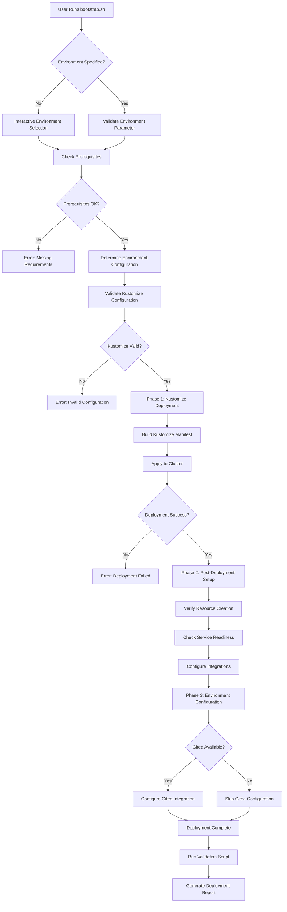
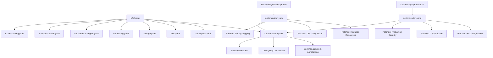
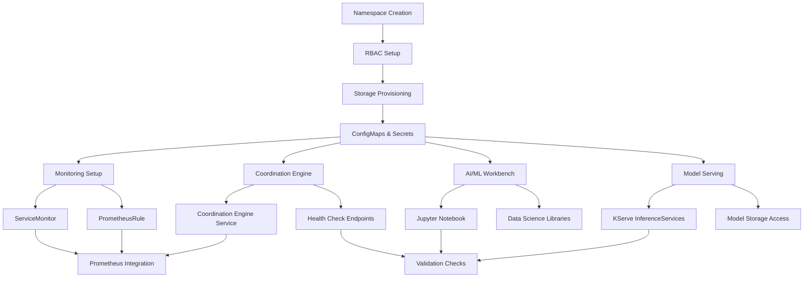
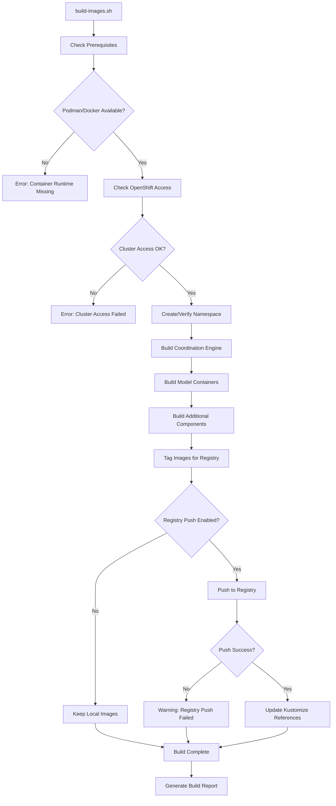
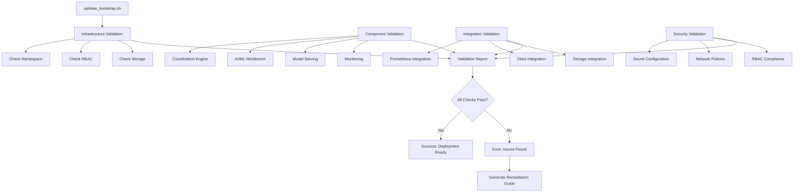

# ADR-009: Bootstrap Deployment Automation Architecture

## Status
**SUPERSEDED** - 2025-10-31 by ADR-019 (Validated Patterns Framework Adoption)

**Original Status**: ACCEPTED - 2025-01-09

## Supersession Notice

This ADR has been superseded by **ADR-019: Validated Patterns Framework Adoption**, which replaces the custom Kustomize-based bootstrap system with the industry-standard Validated Patterns OpenShift Framework using Helm + ArgoCD + Ansible roles.

**Migration Path**:
- Custom `bootstrap.sh` → `make install` (Validated Patterns)
- Kustomize configuration → Helm charts + values files
- Manual validation → Ansible role-based validation
- Custom Ansible tasks → 8 production-ready Ansible roles

See ADR-019 for the new deployment architecture and ADR-020 for the unified bootstrap lifecycle.

## Context

The Self-Healing Platform requires a sophisticated deployment automation system that can:

1. **Deploy Complex Multi-Component Architecture**: Coordinate deployment of coordination engine, ML models, monitoring, storage, and AI/ML workbenches
2. **Support Multiple Environments**: Handle development, staging, and production deployments with different configurations
3. **Ensure Deployment Reliability**: Validate prerequisites, handle failures gracefully, and provide comprehensive validation
4. **Integrate with GitOps**: Support both manual deployment and GitOps workflows
5. **Handle Container Image Management**: Build, tag, and deploy custom container images
6. **Provide Operational Visibility**: Comprehensive logging, validation, and troubleshooting capabilities

### Current Deployment Challenges

- **Manual Deployment Complexity**: 8+ ADRs translate to 20+ Kubernetes resources across multiple namespaces
- **Environment Configuration Management**: Different resource requirements, security policies, and integrations per environment
- **Dependency Management**: Complex interdependencies between operators, storage, networking, and custom applications
- **Validation Requirements**: Need to verify ADR compliance and operational readiness
- **Container Image Lifecycle**: Custom images need building, testing, and registry management

### Technology Constraints

- **OpenShift 4.18+**: Must leverage OpenShift-specific features and operators
- **Kustomize**: Native Kubernetes configuration management
- **Existing Operators**: Red Hat OpenShift AI, KServe, NVIDIA GPU Operator, etc.
- **Security Requirements**: RBAC, network policies, secret management
- **Resource Constraints**: GPU availability, storage classes, compute limits

## Decision

We will implement a **Kustomize-based Bootstrap Automation System** with the following architecture:

### 1. **Layered Configuration Architecture**

```
Bootstrap System Architecture
├── build-images.sh           # Container image build automation
├── bootstrap.sh              # Main deployment orchestration
├── validate_bootstrap.sh     # Post-deployment validation
└── k8s/                      # Kustomize configuration hierarchy
    ├── base/                 # Base configuration (environment-agnostic)
    │   ├── kustomization.yaml
    │   ├── namespace.yaml
    │   ├── rbac.yaml
    │   ├── storage.yaml
    │   ├── monitoring.yaml
    │   ├── coordination-engine.yaml
    │   ├── ai-ml-workbench.yaml
    │   └── model-serving.yaml
    └── overlays/              # Environment-specific configurations
        ├── development/
        │   └── kustomization.yaml
        └── production/
            └── kustomization.yaml
```

### 2. **Three-Phase Deployment Process**

**Phase 1: Kustomize Deployment**
- Environment detection and validation
- Kustomize configuration building and validation
- Atomic deployment of all resources
- Initial resource verification

**Phase 2: Post-Deployment Setup**
- Service readiness verification
- Integration configuration (Gitea, monitoring)
- Secret validation and warnings
- Component health checks

**Phase 3: Environment-Specific Configuration**
- Development vs. production optimizations
- Resource scaling and GPU allocation
- Security policy application
- Monitoring and alerting setup

### 3. **Container Image Management Strategy**

- **Build Automation**: `build-images.sh` handles multi-component image building
- **Registry Integration**: Support for OpenShift internal registry and external registries
- **Image Versioning**: Semantic versioning with environment-specific tags
- **Security Scanning**: Integration with OpenShift image security scanning

## Architecture Diagrams

### Bootstrap Process Flow



### Kustomize Configuration Hierarchy



### Component Deployment Dependencies



### Container Image Build Pipeline



### Validation Architecture



## Implementation Details

### 1. **Bootstrap Script Architecture**

The `bootstrap.sh` script implements a modular, phase-based deployment approach:

```bash
# Core Functions
check_prerequisites()     # Validate cluster, operators, tools
determine_environment()   # Interactive or CLI environment selection
validate_kustomize_config() # Pre-deployment validation
phase1_kustomize_deployment() # Main deployment phase
phase2_post_deployment_setup() # Service verification
phase3_environment_config() # Environment-specific setup
configure_gitea_integration() # Optional Gitea setup
```

**Key Design Decisions**:
- **Fail-Fast Validation**: Comprehensive prerequisite checking before deployment
- **Atomic Deployment**: Single Kustomize apply for consistency
- **Graceful Degradation**: Continue deployment if optional components fail
- **Comprehensive Logging**: Detailed logging with timestamps and log levels

### 2. **Kustomize Configuration Strategy**

**Base Configuration Principles**:
- **Single Source of Truth**: All resources defined in base configuration
- **Environment Agnostic**: Base contains no environment-specific settings
- **Comprehensive Coverage**: All 8 ADRs represented in base resources
- **Consistent Labeling**: Common labels for resource management

**Overlay Strategy**:
- **Minimal Patches**: Only override what's different per environment
- **Resource Scaling**: CPU, memory, and replica adjustments
- **Feature Toggles**: GPU support, debug logging, security policies
- **Storage Classes**: Environment-appropriate storage configurations

### 3. **Container Image Management**

**Build Strategy**:
- **Multi-Stage Builds**: Optimized container images with security scanning
- **Registry Flexibility**: Support internal OpenShift registry and external registries
- **Version Management**: Semantic versioning with environment tags
- **Security Hardening**: Non-root users, minimal base images, vulnerability scanning

**Image Update Process**:
```bash
# Automatic Kustomize updates when using custom registry
if [ "$REGISTRY" != "registry.redhat.io" ]; then
    sed -i "s|old-image|$REGISTRY/$NAMESPACE/new-image:$TAG|g" k8s/base/*.yaml
fi
```

### 4. **Validation Framework**

**Multi-Layer Validation**:
- **Pre-Deployment**: Kustomize syntax, cluster access, prerequisites
- **Deployment-Time**: Resource creation, service startup, health checks
- **Post-Deployment**: End-to-end functionality, integration testing
- **Ongoing**: Continuous monitoring and alerting

**ADR Compliance Validation**:
Each ADR has specific validation checks:
- **ADR-001**: OpenShift version and feature availability
- **ADR-002**: Coordination engine deployment and API accessibility
- **ADR-003**: OpenShift AI operator and notebook functionality
- **ADR-004**: KServe deployment and model serving capability
- **ADR-005**: MCO access permissions and configuration
- **ADR-006**: GPU operator and resource allocation
- **ADR-007**: Prometheus integration and metrics collection
- **ADR-008**: Kubeflow pipeline availability and execution

## Alternatives Considered

### 1. **Helm-Based Deployment**
**Rejected** because:
- Less native Kubernetes integration than Kustomize
- More complex templating for environment management
- Additional tool dependency (Helm CLI)
- OpenShift prefers Kustomize for GitOps workflows

### 2. **Operator-Based Deployment**
**Rejected** because:
- Significant development overhead for custom operator
- Complex lifecycle management for multi-component system
- Overkill for deployment automation needs
- Would delay implementation timeline

### 3. **ArgoCD-Only Deployment**
**Rejected** because:
- Requires ArgoCD to be pre-installed and configured
- Less flexibility for development and testing workflows
- Bootstrap script provides immediate deployment capability
- Can be integrated with ArgoCD later (GitOps evolution)

### 4. **Shell Script with Inline YAML**
**Rejected** because:
- Poor maintainability and version control
- No environment configuration management
- Difficult to validate and test
- Not compatible with GitOps workflows

## Consequences

### Positive Consequences

1. **Deployment Reliability**
   - Comprehensive validation reduces deployment failures
   - Atomic deployment ensures consistency
   - Rollback capabilities through Kustomize

2. **Environment Management**
   - Clean separation of environment-specific configurations
   - Easy to add new environments (staging, integration)
   - Consistent deployment process across environments

3. **Operational Excellence**
   - Detailed logging and validation reporting
   - Clear troubleshooting guidance
   - Automated integration detection and configuration

4. **Developer Experience**
   - Simple command-line interface (`./bootstrap.sh --environment dev`)
   - Comprehensive documentation and guides
   - Local testing capabilities

5. **GitOps Readiness**
   - Kustomize configurations work directly with ArgoCD
   - Version-controlled infrastructure as code
   - Audit trail for all configuration changes

### Negative Consequences

1. **Complexity**
   - Multiple scripts and configuration files to maintain
   - Learning curve for team members unfamiliar with Kustomize
   - Debugging requires understanding of multiple layers

2. **Tool Dependencies**
   - Requires Kustomize CLI or OpenShift CLI with Kustomize support
   - Container runtime (Podman/Docker) for image building
   - OpenShift cluster with specific operator versions

3. **Initial Setup Overhead**
   - Container images must be built before first deployment
   - Registry configuration required for custom images
   - Comprehensive testing needed for each environment

## Implementation Status

### Completed Components
- ✅ Bootstrap script with three-phase deployment
- ✅ Kustomize base configuration for all ADRs
- ✅ Development and production overlays
- ✅ Container image build automation
- ✅ Comprehensive validation framework
- ✅ Gitea integration detection and configuration
- ✅ Documentation and troubleshooting guides
- ✅ **Delete/cleanup functionality** (`--delete` flag)
- ✅ **OpenShift Data Foundation integration** (RWX storage support)

### Remaining Work
- [ ] Production-specific network policies and security configurations
- [ ] Backup and disaster recovery integration
- [ ] Advanced monitoring dashboard deployment
- [ ] Integration testing automation
- [ ] Performance benchmarking integration

## Monitoring and Success Metrics

### Deployment Success Metrics
- **Deployment Success Rate**: Target >95% for development, >99% for production
- **Deployment Time**: Target <10 minutes for development, <15 minutes for production
- **Validation Pass Rate**: Target >98% for all validation checks
- **Time to Recovery**: Target <5 minutes for deployment rollbacks

### Operational Metrics
- **Component Availability**: Target >99.9% uptime for critical components
- **Integration Success**: Target >95% success rate for optional integrations
- **Documentation Accuracy**: Target <2% of deployments requiring additional documentation
- **Developer Satisfaction**: Target >4.5/5 rating for deployment experience

## Related ADRs

- **ADR-001**: OpenShift Platform Selection - Bootstrap validates OpenShift version and features
- **ADR-002**: Hybrid Self-Healing Approach - Bootstrap deploys coordination engine
- **ADR-003**: OpenShift AI ML Platform - Bootstrap configures AI/ML workbench
- **ADR-004**: KServe Model Serving - Bootstrap deploys model serving infrastructure
- **ADR-005**: Machine Config Operator - Bootstrap configures MCO access permissions
- **ADR-006**: NVIDIA GPU Management - Bootstrap handles GPU resource allocation
- **ADR-007**: Prometheus Monitoring - Bootstrap integrates monitoring and alerting
- **ADR-008**: Kubeflow Pipelines MLOps - Bootstrap prepares MLOps environment

## References

- [Kustomize Documentation](https://kustomize.io/)
- [OpenShift Kustomize Guide](https://docs.openshift.com/container-platform/4.18/applications/working_with_kustomize.html)
- [Bootstrap Script Implementation](../../bootstrap.sh)
- [Kustomize Configuration](../../k8s/)
- [Pre-Bootstrap Checklist](../../PRE_BOOTSTRAP_CHECKLIST.md)
- [Development Workflow](../../DEVELOPMENT_WORKFLOW.md)
