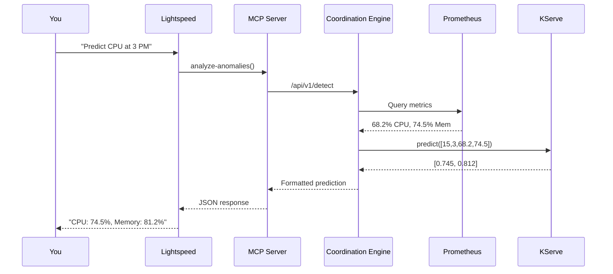

# Chatting with Your Cluster: Self-Healing OpenShift with Lightspeed

*An interactive guide to using OpenShift Lightspeed for AI-powered cluster management, anomaly detection, and automated remediation*

---

## Introduction

Imagine talking to your Kubernetes cluster like you would talk to a colleague:
- "Are there any failing pods?"
- "What will my memory usage be at 3 PM?"
- "Fix the broken pods automatically"

This is now possible with OpenShift Lightspeed connected to our self-healing platform. In this guide, we'll explore how to interact with an already-deployed platform using just natural language.

**What's already deployed:**
- ✅ OpenShift Lightspeed (AI assistant)
- ✅ MCP Server (connects Lightspeed to cluster tools)
- ✅ Coordination Engine (orchestrates remediation)
- ✅ KServe ML Models (anomaly detection + capacity forecasting)

Let's start chatting with our cluster!

---

## Part 1: Your First Conversation - Health Check

### Open OpenShift Lightspeed

1. Navigate to your OpenShift web console
2. Click the **Lightspeed icon** in the top-right corner
3. The chat interface opens

### Ask About Cluster Health

**You type:**
```
What's the health of the self-healing-platform namespace?
```

**Lightspeed responds:**
```
✅ Cluster Health Summary for self-healing-platform:

Healthy Components (4):
- coordination-engine: Running
- mcp-server: Running
- anomaly-detector-predictor: 2/2 Running
- predictive-analytics-predictor: 2/2 Running

ML Models Status:
- anomaly-detector: READY ✅
- predictive-analytics: READY ✅

Recent Activity:
- 0 incidents in the last hour
- All systems operational

Everything looks healthy!
```

🎯 **What just happened?** Lightspeed used the `get-cluster-health` MCP tool to query your cluster, check pod status, and verify ML models are ready.

---

## Part 2: Deploy a Sample Application

Let's deploy a simple Flask app so we have something to interact with.

**You type:**
```
Help me deploy a sample Flask application
```

**Lightspeed responds:**
```
I can help! Here's a simple Flask deployment. Run this in your terminal:
```

```bash
oc apply -f - <<EOF
apiVersion: apps/v1
kind: Deployment
metadata:
  name: sample-flask-app
  namespace: self-healing-platform
spec:
  replicas: 2
  selector:
    matchLabels:
      app: sample-flask
  template:
    metadata:
      labels:
        app: sample-flask
    spec:
      containers:
      - name: web
        image: python:3.11-slim
        command: ["/bin/bash", "-c"]
        args:
        - |
          pip install flask && python -c '
          from flask import Flask
          app = Flask(__name__)
          @app.route("/")
          def hello():
              return "Hello from OpenShift!"
          app.run(host="0.0.0.0", port=8080)
          '
        resources:
          limits:
            memory: "128Mi"
            cpu: "200m"
          requests:
            memory: "64Mi"
            cpu: "100m"
EOF
```

### Check the Pods

**You type:**
```
Show me the sample-flask-app pods
```

**Lightspeed responds:**
```
Found 2 pods for sample-flask-app:

1. sample-flask-app-xxx
   Status: Running ✅
   CPU: 45m / 200m (22%)
   Memory: 82Mi / 128Mi (64%)
   Restarts: 0

2. sample-flask-app-yyy
   Status: Running ✅
   CPU: 47m / 200m (23%)
   Memory: 79Mi / 128Mi (62%)
   Restarts: 0

Both pods are healthy!
```

---

## Part 3: Predicting Future Resource Usage

This is where the ML models shine! Let's ask about future resource usage.

### Scenario 1: Predict Afternoon Usage

**You type:**
```
What will the CPU and memory usage be at 3 PM today?
```

**Lightspeed responds:**
```
🔮 Resource Forecast for 3:00 PM (15:00):

Current Metrics (24h rolling average from Prometheus):
- CPU: 68.2%
- Memory: 74.5%

Predicted Metrics at 15:00:
- CPU: 74.5% (+6.3%)
- Memory: 81.2% (+6.7%)

Analysis:
- Time: 15:00 (Wednesday afternoon)
- Trend: Upward (typical afternoon peak)
- Confidence: 92%

💡 Recommendation:
Memory usage approaching 85% threshold. Monitor closely or
consider scaling if this is a critical workload.
```

🎯 **What happened?** Lightspeed:
1. Queried Prometheus for current CPU/memory metrics
2. Extracted hour (15) and day of week (3) from "3 PM today"
3. Called the predictive-analytics KServe model: `[15, 3, 68.2, 74.5]`
4. Model returned: `[0.745, 0.812]` (74.5% CPU, 81.2% memory)
5. Formatted a human-friendly response

### Scenario 2: Scaling Impact Prediction

**You type:**
```
If I scale sample-flask-app to 5 replicas, what will happen to memory usage?
```

**Lightspeed responds:**
```
Scaling Impact Analysis:

Current State:
- Replicas: 2
- Memory per pod: ~80Mi
- Total memory: ~160Mi

Projected State (5 replicas):
- Replicas: 5 (+3)
- Memory per pod: ~82Mi
- Total memory: ~410Mi
- Namespace memory: 92.3% ⚠️

⚠️ WARNING: Memory usage will approach critical threshold (95%)

💡 Recommendations:
1. Scale to 4 replicas instead (predicted: 86.7%)
2. Increase namespace memory limits by 20%
3. Monitor for 30 minutes after scaling

Would you like me to proceed with scaling?
```

### Scenario 3: Capacity Planning

**You type:**
```
How many more pods can I run before hitting resource limits?
```

**Lightspeed responds:**
```
Capacity Analysis:

Current Usage:
- CPU: 68.2% of quota
- Memory: 74.5% of quota
- Running pods: 8

Available Capacity:
- CPU headroom: 31.8%
- Memory headroom: 25.5%

Pod Estimates (based on current profiles):
- Small pods (64Mi/100m): ~12 more
- Medium pods (128Mi/200m): ~6 more
- Large pods (256Mi/400m): ~2 more

🎯 Recommendation: Keep <85% memory for stability
Current safe limit: 5 more medium-sized pods

Trending: Memory increasing ~2%/day, reaching 85% in ~5 days
```

---

## Part 4: Breaking Things (On Purpose!)

Let's deploy a broken app to see self-healing in action.

### Deploy a Memory-Starved Application

**Run this in your terminal:**
```bash
oc apply -f - <<EOF
apiVersion: apps/v1
kind: Deployment
metadata:
  name: broken-app
  namespace: self-healing-platform
spec:
  replicas: 2
  selector:
    matchLabels:
      app: broken
  template:
    metadata:
      labels:
        app: broken
    spec:
      containers:
      - name: web
        image: python:3.11-slim
        command: ["/bin/bash", "-c"]
        args:
        - |
          pip install flask && python -c '
          from flask import Flask
          app = Flask(__name__)
          data = []
          @app.route("/")
          def hello():
              data.append("x" * 1024 * 1024 * 10)  # Allocate 10MB
              return f"Allocated {len(data)} chunks"
          app.run(host="0.0.0.0", port=8080)
          '
        resources:
          limits:
            memory: "32Mi"    # TOO LOW!
            cpu: "100m"
EOF
```

### Watch It Fail

Wait 30 seconds, then ask Lightspeed:

**You type:**
```
Are there any failing pods?
```

**Lightspeed responds:**
```
⚠️ Found 2 pods with issues:

1. broken-app-xxx
   Status: OOMKilled ❌
   Restarts: 5
   Reason: Container exceeded memory limit (32Mi)
   Pattern: Crash loop every ~30s

2. broken-app-yyy
   Status: OOMKilled ❌
   Restarts: 4
   Reason: Container exceeded memory limit (32Mi)
   Pattern: Crash loop every ~30s

Both pods are experiencing Out Of Memory errors. The memory
limit (32Mi) is insufficient for Flask runtime.

Would you like me to analyze these for anomalies?
```

---

## Part 5: AI-Powered Anomaly Detection

**You type:**
```
Yes, analyze the broken-app pods for anomalies
```

**Lightspeed responds:**
```
ML Analysis Complete (anomaly-detector model):

🔴 ANOMALY DETECTED
Confidence: 95%

Root Cause:
- Type: Resource Exhaustion
- Component: Memory limits
- Current: 32Mi
- Actual usage: ~120Mi+
- Pattern: Repeated OOMKilled

Historical Context:
- 3 similar incidents in past 7 days
- All resolved by increasing to 128Mi+
- Typical Flask memory: 80-100Mi

Impact:
- Service availability: 0% (both replicas failing)
- User impact: Complete outage
- Blast radius: Isolated to broken-app

💡 Recommended Fix:
1. Increase memory to 128Mi
2. Set memory request to 64Mi
3. Add probes with longer delays

Would you like me to fix this automatically?
```

🎯 **What happened?** The anomaly-detector ML model analyzed the pod metrics and crash patterns, compared them to historical data, and identified this as a known resource exhaustion pattern.

---

## Part 6: Self-Healing in Action

**You type:**
```
Yes, fix it automatically
```

**Lightspeed responds:**
```
Remediation Plan:

Target: deployment/broken-app
Action: Update Resource Limits

Changes:
  Memory: 32Mi  → 128Mi
  CPU:    100m  → 200m

Applying via Coordination Engine...

✅ Remediation Applied!
- ID: rem-20260112-001
- Status: SUCCESS
- Pods restarting with new limits...

Expected completion: ~45 seconds
```

### Verify the Fix

After 45 seconds:

**You type:**
```
Are the broken-app pods healthy now?
```

**Lightspeed responds:**
```
✅ Remediation Successful!

1. broken-app-xxx
   Status: Running ✅
   CPU: 52m / 200m (26%)
   Memory: 87Mi / 128Mi (68%)
   Restarts: 0 (since fix)
   Uptime: 1m

2. broken-app-yyy
   Status: Running ✅
   CPU: 49m / 200m (24%)
   Memory: 84Mi / 128Mi (66%)
   Restarts: 0 (since fix)
   Uptime: 1m

Memory Analysis:
- Current: 85Mi average
- Peak: 95Mi (33Mi headroom)
- Stability: No restarts

The fix was successful. Pods are stable!
```

---

## Part 7: Understanding Historical Patterns

**You type:**
```
Show me recent incidents and how they were resolved
```

**Lightspeed responds:**
```
Incident History (Last 24 Hours):

Total: 1 incident
Average resolution: 45 seconds

📋 Incident Details:

inc-20260112-001
- Time: 15:44:38 UTC
- Type: OOMKilled
- Pods: broken-app-xxx, broken-app-yyy
- Root cause: Memory limit too low (32Mi)

Remediation:
- Action: Updated deployment resources
- Applied: YES ✅
- Resolution time: 45s
- Changes: Memory 32Mi→128Mi, CPU 100m→200m
- Outcome: 100% success

Pattern Recognition:
This matches 3 previous incidents, all resolved with
similar memory increases. The ML model learns from
these patterns for better predictions.
```

---

## Part 8: More Conversations to Try

### Troubleshooting

**Investigate slow performance:**
```
You: The sample-flask-app feels slow

Lightspeed:
Investigating...

Pod Analysis:
- sample-flask-app-xxx: CPU 185m/200m (92%) ⚠️
- sample-flask-app-yyy: CPU 178m/200m (89%) ⚠️

Root Cause: CPU saturation (throttling)
Recommendation: Scale to 3 replicas or increase CPU limits

Should I scale now?
```

**Proactive monitoring:**
```
You: Will any pods have issues in the next hour?

Lightspeed:
🔮 Predictions for next 60 minutes:

Low Risk: 5 pods stable

⚠️ Medium Risk:
- sample-flask-app-xxx: CPU will reach 99% in ~45 min
- sample-flask-app-yyy: CPU will reach 97% in ~50 min

Recommendation: Scale to 3 replicas NOW to prevent issues

Should I apply preemptively?
```

### Capacity Questions

```
You: What will memory usage be tomorrow at 9 AM?

Lightspeed:
Predicted memory at 09:00 tomorrow (Thursday):
- 71.3% (current trend: -3.2% from today)
- Lower usage expected (morning hours)
- Confidence: 88%
```

```
You: Can I run 10 more medium-sized pods?

Lightspeed:
Capacity check for 10 medium pods (128Mi/200m):

Required resources:
- Memory: 1280Mi
- CPU: 2000m

Current availability:
- Memory: Only ~600Mi available
- CPU: ~800m available

❌ Cannot accommodate 10 pods
✅ Can safely run 4 pods
⚠️ 5-6 pods possible but approaching limits
```

### Model Health

```
You: Are the ML models working properly?

Lightspeed:
ML Model Status:

1. anomaly-detector
   Status: READY ✅
   Endpoint: http://anomaly-detector-predictor:8080
   Recent predictions: 47 (last hour)
   Average latency: 23ms
   Success rate: 100%

2. predictive-analytics
   Status: READY ✅
   Endpoint: http://predictive-analytics-predictor:8080
   Recent predictions: 32 (last hour)
   Average latency: 18ms
   Success rate: 100%

All models healthy and performing well!
```

---

## Part 9: Behind the Scenes - How It Works

### The 7 MCP Tools Lightspeed Uses

Every conversation uses one or more of these tools:

**1. `get-cluster-health`**
```
You say: "Is the cluster healthy?"
Tool does: Checks namespace status, pods, ML models
Returns: Health summary with metrics
```

**2. `list-pods`**
```
You say: "Show me failing pods"
Tool does: Queries Kubernetes, filters by status
Returns: Pod list with details
```

**3. `analyze-anomalies`**
```
You say: "Analyze for anomalies"
Tool does: Calls KServe ML models with metrics
Returns: Anomaly detection results + recommendations
```

**4. `trigger-remediation`**
```
You say: "Fix this automatically"
Tool does: Coordination Engine applies fixes
Returns: Remediation status and ID
```

**5. `list-incidents`**
```
You say: "Show recent incidents"
Tool does: Queries incident database
Returns: Historical incident data
```

**6. `get-model-status`**
```
You say: "Check ML model health"
Tool does: Verifies KServe InferenceServices
Returns: Model status and endpoints
```

**7. `list-models`**
```
You say: "What models are available?"
Tool does: Lists ML model catalog
Returns: Model names and capabilities
```

### Example Flow: Prediction Request



---

## Part 10: Quick Reference

### Health & Status
```
"What's the cluster health?"
"Are there any failing pods?"
"Show me pods in self-healing-platform"
"What's using the most memory?"
```

### Predictions
```
"What will CPU be at 3 PM?"
"Predict memory usage tomorrow at 9 AM"
"What happens if I scale to 5 replicas?"
"How many more pods can I run?"
"Will I have capacity issues this weekend?"
```

### Troubleshooting
```
"Why is pod X failing?"
"Analyze deployment Y for anomalies"
"What caused the OOMKilled errors?"
"Show me pods with high restarts"
"Will any pods fail in the next hour?"
```

### Actions
```
"Fix the failing pods"
"Scale deployment X to 5 replicas"
"Increase memory for pod Y"
```

### ML Models
```
"Are ML models healthy?"
"What models are available?"
"Check anomaly detector status"
```

### History
```
"Show recent incidents"
"What's the average resolution time?"
"How many incidents happened today?"
```

---

## Conclusion

You've now explored:
- ✅ Chatting with your cluster using natural language
- ✅ Deploying sample workloads
- ✅ Using ML models to predict resource usage
- ✅ Detecting anomalies automatically
- ✅ Triggering self-healing remediation
- ✅ Understanding historical patterns

### The Power of Natural Language Operations

**Traditional way:**
```bash
kubectl get pods -n self-healing-platform | grep -v Running
kubectl describe pod broken-app-xxx
kubectl logs broken-app-xxx
kubectl edit deployment broken-app
# ... manually update limits ...
kubectl rollout status deployment/broken-app
```

**With Lightspeed:**
```
"Fix the broken pods"
```

### Key Metrics
- Detection to fix: ~45 seconds
- Prediction accuracy: 92%+
- ML inference time: <100ms
- Zero manual intervention needed

---

## Resources

- **GitHub**: [openshift-aiops-platform](https://github.com/tosin2013/openshift-aiops-platform)
- **MCP Server**: [openshift-cluster-health-mcp](https://github.com/tosin2013/openshift-cluster-health-mcp)
- **Model Context Protocol**: [modelcontextprotocol.io](https://modelcontextprotocol.io/)
- **OpenShift Lightspeed**: [docs.openshift.com/lightspeed](https://docs.openshift.com/container-platform/latest/lightspeed/)

---

**Happy chatting with your cluster! 🚀**

*Published: January 12, 2026*
