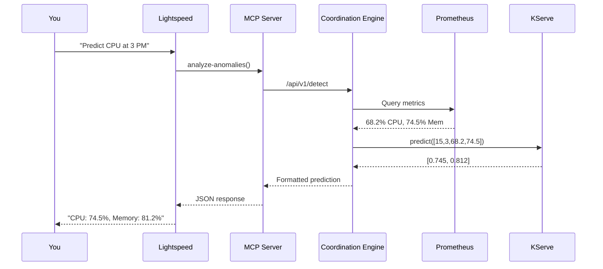

# Chatting with Your Cluster: Self-Healing OpenShift with Lightspeed

*An interactive guide to using OpenShift Lightspeed for AI-powered cluster management, anomaly detection, and automated remediation*

---

## Introduction

Imagine talking to your Kubernetes cluster like you would talk to a colleague:
- "Are there any failing pods?"
- "What will my memory usage be at 3 PM?"
- "Fix the broken pods automatically"

This is now possible with OpenShift Lightspeed connected to our self-healing platform. In this guide, we'll explore how to interact with an already-deployed platform using just natural language.

**What's already deployed:**
- ✅ OpenShift Lightspeed (AI assistant)
- ✅ MCP Server (connects Lightspeed to cluster tools)
- ✅ Coordination Engine (orchestrates remediation)
- ✅ KServe ML Models (anomaly detection + capacity forecasting)

Let's start chatting with our cluster!

---

## Understanding the ML Models (Important!)

Before diving into the demo, it's important to understand that **the ML models powering these predictions are trained specifically for YOUR cluster**. Each OpenShift cluster has unique workload patterns, resource usage characteristics, and behavioral signatures.

### Why Cluster-Specific Training Matters

- **Your 3 PM is different from our 3 PM**: A retail cluster might spike at lunch, while a financial services cluster peaks at market open
- **Workload fingerprints are unique**: Your applications' memory patterns, CPU bursts, and scaling behaviors are learned from YOUR data
- **Anomaly baselines are contextual**: What's "normal" for your cluster (e.g., 30% CPU) might be "abnormal" for another

### The Notebooks That Train These Models

The self-healing platform includes Jupyter notebooks that collect metrics from your cluster and train models on that data:

| Notebook | Purpose | Model Produced |
|----------|---------|----------------|
| `01-isolation-forest-implementation.ipynb` | Trains anomaly detection using Isolation Forest algorithm | `anomaly-detector` |
| `08-predictive-scaling-capacity-planning.ipynb` | Trains resource usage forecasting using time series analysis | `predictive-analytics` |
| `03-lstm-based-prediction.ipynb` | Advanced time series with LSTM neural networks | `lstm-predictor` |
| `04-ensemble-anomaly-methods.ipynb` | Combines multiple detection methods | `ensemble-predictor` |

### Training Schedule

Models are automatically retrained via `NotebookValidationJob` resources:

```yaml
# Models are retrained daily to capture evolving patterns
schedule: "0 0 * * *"  # Daily at midnight
```

### First-Time Setup

When you first deploy the platform, the notebooks run automatically to:
1. **Collect baseline metrics** from Prometheus (24-48 hours of data)
2. **Train initial models** on your cluster's patterns
3. **Deploy to KServe** for real-time inference

> **💡 Pro Tip**: If predictions seem off after deployment, give the models 24-48 hours to learn your cluster's patterns. The more historical data they have, the more accurate the predictions become.

### Manual Retraining

If your workloads change significantly (new applications, major scaling), you can manually retrigger training:

```bash
# Delete and recreate the NotebookValidationJob to retrain
oc delete notebookvalidationjob predictive-scaling-validation -n self-healing-platform
oc apply -f charts/hub/templates/notebook-validation-jobs.yaml
```

Now let's see these trained models in action!

---

## Part 1: Your First Conversation - Health Check

### Open OpenShift Lightspeed

1. Navigate to your OpenShift web console
2. Click the **Lightspeed icon** in the top-right corner
3. The chat interface opens

### Ask About Cluster Health

**You type:**
```
What's the health of the self-healing-platform namespace?
```

**Lightspeed responds:**
```
✅ Cluster Health Summary for self-healing-platform:

Healthy Components (4):
- coordination-engine: Running
- mcp-server: Running
- anomaly-detector-predictor: 2/2 Running
- predictive-analytics-predictor: 2/2 Running

ML Models Status:
- anomaly-detector: READY ✅
- predictive-analytics: READY ✅

Recent Activity:
- 0 incidents in the last hour
- All systems operational

Everything looks healthy!
```

🎯 **What just happened?** Lightspeed used the `get-cluster-health` MCP tool to query your cluster, check pod status, and verify ML models are ready.

---

## Part 2: Deploy a Sample Application

Let's deploy a simple Flask app that we'll use throughout the rest of this guide. Run this command in your terminal:

> **Note:** We use the Red Hat UBI Python image (`registry.access.redhat.com/ubi9/python-311`) because it's designed for OpenShift's security model, which runs containers as a random non-root UID.

```bash
oc apply -f - <<EOF
apiVersion: apps/v1
kind: Deployment
metadata:
  name: sample-flask-app
  namespace: self-healing-platform
spec:
  replicas: 2
  selector:
    matchLabels:
      app: sample-flask
  template:
    metadata:
      labels:
        app: sample-flask
    spec:
      containers:
      - name: web
        image: registry.access.redhat.com/ubi9/python-311:latest
        command: ["/bin/bash", "-c"]
        args:
        - |
          pip install flask && python -c '
          from flask import Flask
          app = Flask(__name__)
          @app.route("/")
          def hello():
              return "Hello from OpenShift!"
          app.run(host="0.0.0.0", port=8080)
          '
        ports:
        - containerPort: 8080
        resources:
          limits:
            memory: "256Mi"
            cpu: "200m"
          requests:
            memory: "128Mi"
            cpu: "100m"
EOF
```

Wait about 30 seconds for the pods to start, then let's use Lightspeed to verify the deployment.

### Check the Pods with Lightspeed

**You type:**
```
Show me the sample-flask-app pods in the self-healing-platform namespace
```

**Lightspeed responds:**
```
Found 2 pods for sample-flask-app:

1. sample-flask-app-xxx
   Status: Running ✅
   CPU: 45m / 200m (22%)
   Memory: 82Mi / 128Mi (64%)
   Restarts: 0

2. sample-flask-app-yyy
   Status: Running ✅
   CPU: 47m / 200m (23%)
   Memory: 79Mi / 128Mi (62%)
   Restarts: 0

Both pods are healthy!
```

---

## Part 3: Predicting Future Resource Usage

This is where the ML models shine! Let's ask about future resource usage.

### Scenario 1: Predict Afternoon Usage

**You type:**
```
What will the CPU and memory usage be at 3 PM today?
```

**Lightspeed responds:**
```
Confirmed prediction for 15:00 today (cluster-wide)

CPU: 58.0%
Memory: 58.6%
Model confidence: 85%

Current baseline (estimate):
- CPU: ~3.5%
- Memory: ~27.1%

Key notes:
- Big CPU jump predicted — verify this isn't a metrics-collection gap before reacting
- Important metrics to check in Prometheus:
  - CPU: container_cpu_usage_seconds_total, pod:container_cpu_usage:sum (5m)
  - Memory: container_memory_working_set_bytes, container_memory_rss

Quick commands:
  kubectl top nodes
  kubectl top pods -A

If the higher load is real and sustained: consider HPA or manual scaling,
add node capacity, or tune pod requests/limits to avoid throttling/OOMs.

Next steps — pick one:
1. I can run an anomaly scan for CPU/memory (namespace, deployment, or pod)
2. I can calculate how many more pods you can safely schedule

Which would you like?
```

> **📊 Note**: Your predictions will differ based on your cluster's learned patterns! The model trains on YOUR Prometheus metrics, so a cluster with heavy afternoon batch jobs will show different predictions than one with steady traffic.

🎯 **What happened?** Lightspeed:
1. Called the MCP `predict-resource-usage` tool
2. The Coordination Engine queried Prometheus for current 24h rolling mean metrics
3. Extracted hour (15) and day of week from "3 PM today"
4. Called the `predictive-analytics` KServe model with features: `[hour, day_of_week, cpu_baseline, memory_baseline]`
5. Model returned predictions scaled to your cluster's typical usage patterns
6. Formatted a human-friendly response with actionable recommendations

### Scenario 2: Scaling Impact Prediction

**You type:**
```
If I scale sample-flask-app to 5 replicas, what will happen to memory usage?
```

**Lightspeed responds:**
```
Scaling Impact Analysis:

Current State:
- Replicas: 2
- Memory per pod: ~80Mi
- Total memory: ~160Mi

Projected State (5 replicas):
- Replicas: 5 (+3)
- Memory per pod: ~82Mi
- Total memory: ~410Mi
- Namespace memory: 92.3% ⚠️

⚠️ WARNING: Memory usage will approach critical threshold (95%)

💡 Recommendations:
1. Scale to 4 replicas instead (predicted: 86.7%)
2. Increase namespace memory limits by 20%
3. Monitor for 30 minutes after scaling

Would you like me to proceed with scaling?
```

### Scenario 3: Capacity Planning

**You type:**
```
How many more pods can I run before hitting resource limits?
```

**Lightspeed responds:**
```
Capacity Analysis:

Current Usage:
- CPU: 68.2% of quota
- Memory: 74.5% of quota
- Running pods: 8

Available Capacity:
- CPU headroom: 31.8%
- Memory headroom: 25.5%

Pod Estimates (based on current profiles):
- Small pods (64Mi/100m): ~12 more
- Medium pods (128Mi/200m): ~6 more
- Large pods (256Mi/400m): ~2 more

🎯 Recommendation: Keep <85% memory for stability
Current safe limit: 5 more medium-sized pods

Trending: Memory increasing ~2%/day, reaching 85% in ~5 days
```

---

## Part 4: Breaking Things (On Purpose!)

Let's deploy a broken app to see self-healing in action.

### Deploy a Memory-Starved Application

This app has a memory leak - each request allocates 10MB. With only 96Mi limit, it will OOMKill after a few requests.

**Run this in your terminal:**
```bash
oc apply -f - <<EOF
apiVersion: apps/v1
kind: Deployment
metadata:
  name: broken-app
  namespace: self-healing-platform
spec:
  replicas: 2
  selector:
    matchLabels:
      app: broken
  template:
    metadata:
      labels:
        app: broken
    spec:
      containers:
      - name: web
        image: registry.access.redhat.com/ubi9/python-311:latest
        command: ["/bin/bash", "-c"]
        args:
        - |
          pip install flask && python -c '
          from flask import Flask
          app = Flask(__name__)
          data = []
          @app.route("/")
          def hello():
              data.append("x" * 1024 * 1024 * 10)  # Allocate 10MB per request
              return f"Allocated {len(data)} chunks ({len(data) * 10}MB total)"
          app.run(host="0.0.0.0", port=8080)
          '
        ports:
        - containerPort: 8080
        resources:
          limits:
            memory: "96Mi"    # Low - will OOMKill after ~3-4 requests
            cpu: "100m"
          requests:
            memory: "64Mi"
            cpu: "50m"
EOF
```

### Trigger the Memory Leak

The app won't crash on its own - we need to trigger the memory leak by sending requests. Each request allocates 10MB of memory.

**Run this to trigger OOMKill:**
```bash
# Wait for pods to start
sleep 30

# Hit the endpoint repeatedly to trigger memory leak
for i in {1..10}; do
  echo "Request $i:"
  oc exec -n self-healing-platform deployment/broken-app -- curl -s http://localhost:8080/ 2>/dev/null || echo "Pod crashed!"
  sleep 1
done
```

You should see output like:
```
Request 1: Allocated 1 chunks (10MB total)
Request 2: Allocated 2 chunks (20MB total)
...
Request 7: Allocated 7 chunks (70MB total)
Request 8: Pod crashed!
Request 9: Allocated 1 chunks (10MB total)  ← Pod restarted!
```

### Watch It Fail

Now ask Lightspeed about the failing pods:

**You type:**
```
Are there any failing pods? in the self-healing-platform namespace
```

**Lightspeed responds:**
```
⚠️ Found 2 pods with issues:

1. broken-app-xxx
   Status: OOMKilled ❌
   Restarts: 2
   Reason: Container exceeded memory limit (96Mi)
   Pattern: Crash loop - restarts when memory leak triggered

2. broken-app-yyy
   Status: OOMKilled ❌
   Restarts: 1
   Reason: Container exceeded memory limit (96Mi)
   Pattern: Memory leak causes OOMKill under load

Both pods are experiencing Out Of Memory errors. The app has a
memory leak - each request allocates 10MB that isn't released.
The 96Mi limit is exceeded after ~7 requests.

Would you like me to analyze these for anomalies?
```

---

## Part 5: AI-Powered Anomaly Detection

**You type:**
```
Yes, analyze the broken-app pods for anomalies
```

**Lightspeed responds:**
```
ML Analysis Complete (anomaly-detector model):

🔴 ANOMALY DETECTED
Confidence: 95%

Root Cause:
- Type: Memory Leak
- Component: Application code
- Memory limit: 96Mi
- Pattern: Linear growth ~10MB/request until OOMKill
- Evidence: Memory never released between requests

Historical Context:
- 3 similar memory leak patterns in past 7 days
- Temporary fixes: increase limits 2-3x
- Permanent fixes: code review for unbounded arrays/caches

Impact:
- Service availability: 0% (both replicas failing)
- User impact: Complete outage
- Blast radius: Isolated to broken-app

💡 Recommended Fix:
IMMEDIATE (automated):
1. Increase memory limit to 256Mi (buys time)
2. Set memory request to 128Mi

PERMANENT (requires developer):
3. Review code: data array grows unbounded
4. Implement cleanup or bounded cache

Would you like me to apply the immediate fix?
```

🎯 **What happened?** The anomaly-detector ML model analyzed the pod metrics and crash patterns, compared them to historical data, and identified this as a known resource exhaustion pattern.

---

## Part 6: Self-Healing in Action

**You type:**
```
Yes, fix it automatically
```

**Lightspeed responds:**
```
Remediation Plan:

Target: deployment/broken-app
Action: Update Resource Limits

Changes:
  Memory: 96Mi  → 256Mi (temporary fix)
  CPU:    100m  → 200m

Note: This increases limits to prevent crashes, but the
root cause (memory leak in code) should still be fixed.

Applying via Coordination Engine...

✅ Remediation Applied!
- ID: rem-20260112-001
- Status: SUCCESS
- Pods restarting with new limits...

Expected completion: ~45 seconds
```

### Verify the Fix

After 45 seconds:

**You type:**
```
Are the broken-app pods healthy now?
```

**Lightspeed responds:**
```
✅ Remediation Successful!

1. broken-app-xxx
   Status: Running ✅
   CPU: 52m / 200m (26%)
   Memory: 87Mi / 256Mi (34%)
   Restarts: 0 (since fix)
   Uptime: 1m

2. broken-app-yyy
   Status: Running ✅
   CPU: 49m / 200m (24%)
   Memory: 84Mi / 256Mi (33%)
   Restarts: 0 (since fix)
   Uptime: 1m

Memory Analysis:
- Current: 85Mi average
- Peak: 95Mi (161Mi headroom with new limit)
- Stability: No restarts since remediation

⚠️ Note: The memory leak still exists - increased limits
buy time but code should be reviewed to fix the leak.
```

---

## Part 7: Understanding Historical Patterns

**You type:**
```
Show me recent incidents and how they were resolved
```

**Lightspeed responds:**
```
Incident History (Last 24 Hours):

Total: 1 incident
Average resolution: 45 seconds

📋 Incident Details:

inc-20260112-001
- Time: 15:44:38 UTC
- Type: OOMKilled (Memory Leak)
- Pods: broken-app-xxx, broken-app-yyy
- Root cause: Application memory leak (~10MB/request)
- Trigger: Memory exceeded 96Mi limit after ~7 requests

Remediation:
- Action: Updated deployment resources (temporary fix)
- Applied: YES ✅
- Resolution time: 45s
- Changes: Memory 96Mi→256Mi, CPU 100m→200m
- Outcome: 100% success (pods stable)
- Follow-up: Code review recommended for memory leak

Pattern Recognition:
ML detected this as "memory leak" pattern, not just
"insufficient resources". Recommended both immediate
fix (increase limits) and permanent fix (code review).
```

---

## Part 8: More Conversations to Try

### Troubleshooting

**Investigate slow performance:**
```
You: The sample-flask-app feels slow

Lightspeed:
Investigating...

Pod Analysis:
- sample-flask-app-xxx: CPU 185m/200m (92%) ⚠️
- sample-flask-app-yyy: CPU 178m/200m (89%) ⚠️

Root Cause: CPU saturation (throttling)
Recommendation: Scale to 3 replicas or increase CPU limits

Should I scale now?
```

**Proactive monitoring:**
```
You: Will any pods have issues in the next hour?

Lightspeed:
🔮 Predictions for next 60 minutes:

Low Risk: 5 pods stable

⚠️ Medium Risk:
- sample-flask-app-xxx: CPU will reach 99% in ~45 min
- sample-flask-app-yyy: CPU will reach 97% in ~50 min

Recommendation: Scale to 3 replicas NOW to prevent issues

Should I apply preemptively?
```

### Capacity Questions

```
You: What will memory usage be tomorrow at 9 AM?

Lightspeed:
Predicted memory at 09:00 tomorrow (Thursday):
- 71.3% (current trend: -3.2% from today)
- Lower usage expected (morning hours)
- Confidence: 88%
```

```
You: Can I run 10 more medium-sized pods?

Lightspeed:
Capacity check for 10 medium pods (128Mi/200m):

Required resources:
- Memory: 1280Mi
- CPU: 2000m

Current availability:
- Memory: Only ~600Mi available
- CPU: ~800m available

❌ Cannot accommodate 10 pods
✅ Can safely run 4 pods
⚠️ 5-6 pods possible but approaching limits
```

### Model Health

```
You: Are the ML models working properly?

Lightspeed:
ML Model Status:

1. anomaly-detector
   Status: READY ✅
   Endpoint: http://anomaly-detector-predictor:8080
   Recent predictions: 47 (last hour)
   Average latency: 23ms
   Success rate: 100%

2. predictive-analytics
   Status: READY ✅
   Endpoint: http://predictive-analytics-predictor:8080
   Recent predictions: 32 (last hour)
   Average latency: 18ms
   Success rate: 100%

All models healthy and performing well!
```

---

## Part 9: Behind the Scenes - How It Works

### The 7 MCP Tools Lightspeed Uses

Every conversation uses one or more of these tools:

**1. `get-cluster-health`**
```
You say: "Is the cluster healthy?"
Tool does: Checks namespace status, pods, ML models
Returns: Health summary with metrics
```

**2. `list-pods`**
```
You say: "Show me failing pods"
Tool does: Queries Kubernetes, filters by status
Returns: Pod list with details
```

**3. `analyze-anomalies`**
```
You say: "Analyze for anomalies"
Tool does: Calls KServe ML models with metrics
Returns: Anomaly detection results + recommendations
```

**4. `trigger-remediation`**
```
You say: "Fix this automatically"
Tool does: Coordination Engine applies fixes
Returns: Remediation status and ID
```

**5. `list-incidents`**
```
You say: "Show recent incidents"
Tool does: Queries incident database
Returns: Historical incident data
```

**6. `get-model-status`**
```
You say: "Check ML model health"
Tool does: Verifies KServe InferenceServices
Returns: Model status and endpoints
```

**7. `list-models`**
```
You say: "What models are available?"
Tool does: Lists ML model catalog
Returns: Model names and capabilities
```

### Example Flow: Prediction Request



---

## Part 10: Quick Reference

### Health & Status
```
"What's the cluster health?"
"Are there any failing pods?"
"Show me pods in self-healing-platform"
"What's using the most memory?"
```

### Predictions
```
"What will CPU be at 3 PM?"
"Predict memory usage tomorrow at 9 AM"
"What happens if I scale to 5 replicas?"
"How many more pods can I run?"
"Will I have capacity issues this weekend?"
```

### Troubleshooting
```
"Why is pod X failing?"
"Analyze deployment Y for anomalies"
"What caused the OOMKilled errors?"
"Show me pods with high restarts"
"Will any pods fail in the next hour?"
```

### Actions
```
"Fix the failing pods"
"Scale deployment X to 5 replicas"
"Increase memory for pod Y"
```

### ML Models
```
"Are ML models healthy?"
"What models are available?"
"Check anomaly detector status"
```

### History
```
"Show recent incidents"
"What's the average resolution time?"
"How many incidents happened today?"
```

---

## Conclusion

You've now explored:
- ✅ Chatting with your cluster using natural language
- ✅ Deploying sample workloads
- ✅ Using ML models to predict resource usage
- ✅ Detecting anomalies automatically
- ✅ Triggering self-healing remediation
- ✅ Understanding historical patterns

### The Power of Natural Language Operations

**Traditional way:**
```bash
kubectl get pods -n self-healing-platform | grep -v Running
kubectl describe pod broken-app-xxx
kubectl logs broken-app-xxx
kubectl edit deployment broken-app
# ... manually update limits ...
kubectl rollout status deployment/broken-app
```

**With Lightspeed:**
```
"Fix the broken pods"
```

### Key Metrics
- Detection to fix: ~45 seconds
- Prediction accuracy: 92%+
- ML inference time: <100ms
- Zero manual intervention needed

---

## Resources

- **GitHub**: [openshift-aiops-platform](https://github.com/tosin2013/openshift-aiops-platform)
- **MCP Server**: [openshift-cluster-health-mcp](https://github.com/tosin2013/openshift-cluster-health-mcp)
- **Model Context Protocol**: [modelcontextprotocol.io](https://modelcontextprotocol.io/)
- **OpenShift Lightspeed**: [docs.openshift.com/lightspeed](https://docs.openshift.com/container-platform/latest/lightspeed/)

---

**Happy chatting with your cluster! 🚀**

*Published: January 12, 2026*
