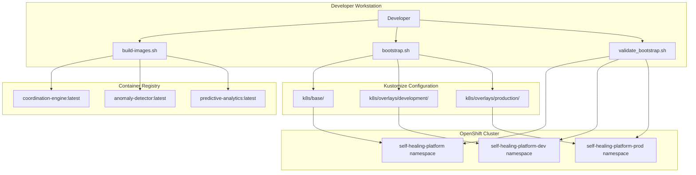
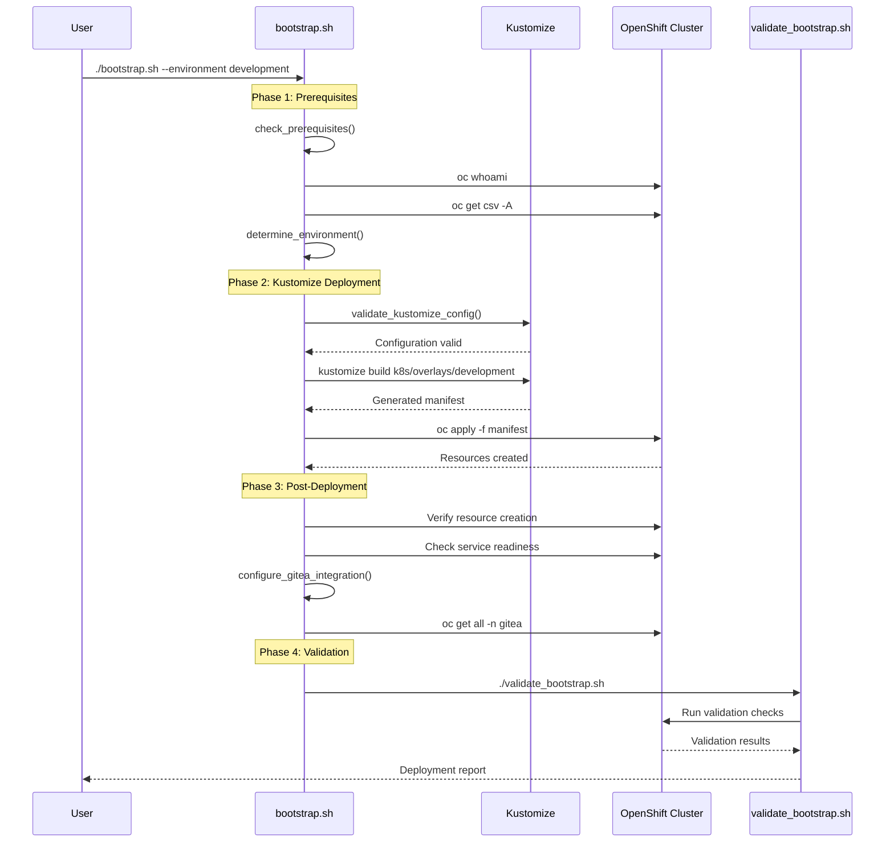
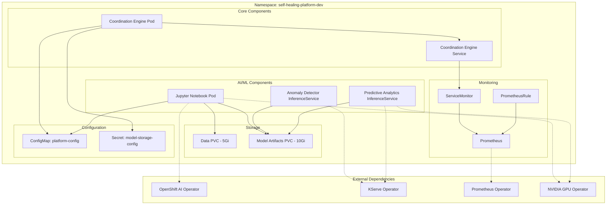
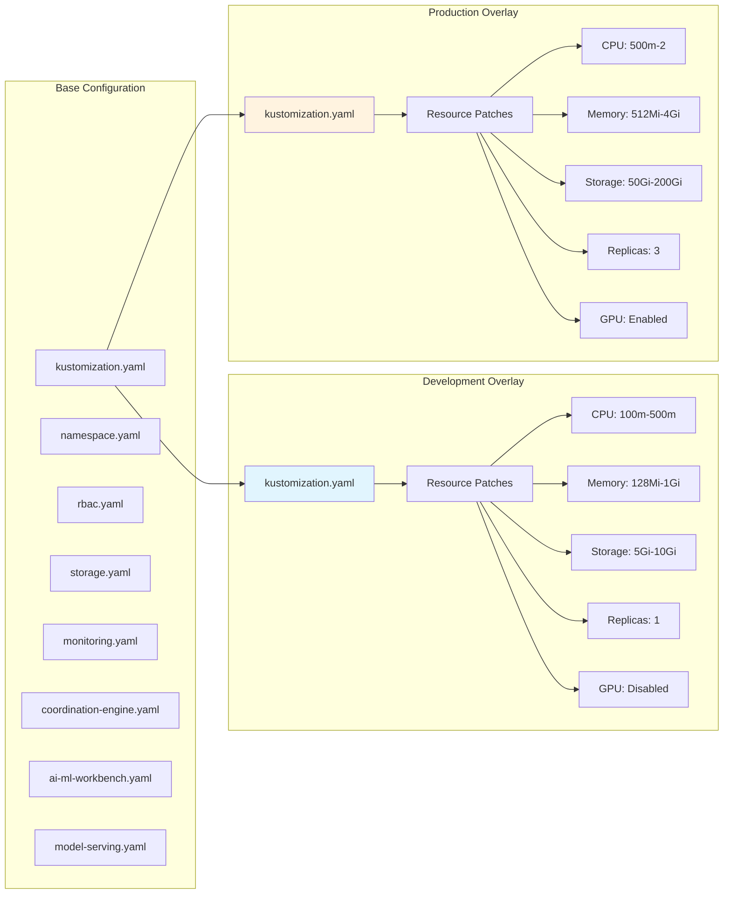
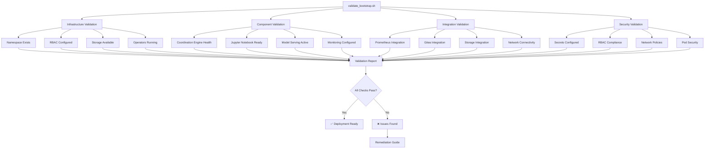
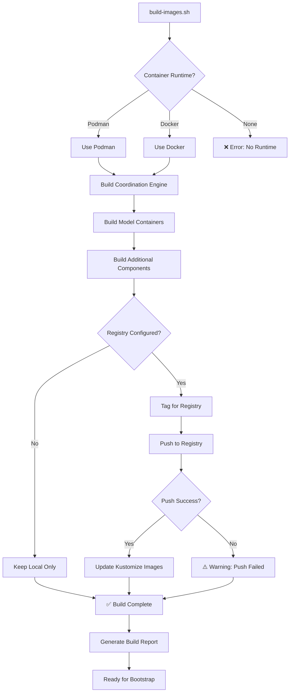
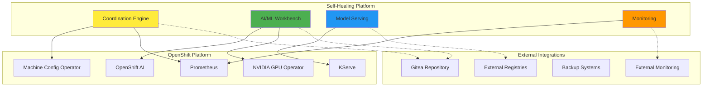
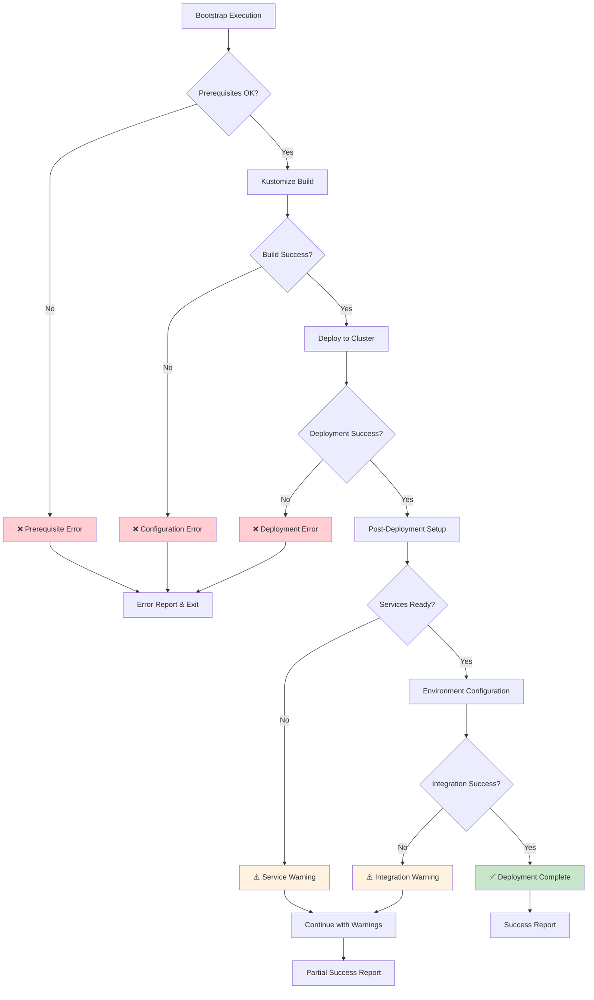

# Bootstrap Architecture Diagrams

This document contains visual diagrams for the Self-Healing Platform Bootstrap Architecture (ADR-009).

## System Overview



## Bootstrap Execution Flow



## Component Deployment Architecture



## Kustomize Overlay Strategy



## Validation Framework Architecture



## Container Image Build Pipeline



## Environment Configuration Matrix

```mermaid
graph TD
    subgraph "Development Environment"
        A[Namespace: self-healing-platform-dev]
        B[Resources: Minimal]
        C[Storage: Standard Classes]
        D[GPU: Disabled]
        E[Logging: DEBUG]
        F[Replicas: 1]
        G[Security: Basic]
    end

    subgraph "Production Environment"
        H[Namespace: self-healing-platform]
        I[Resources: High Performance]
        J[Storage: Premium Classes]
        K[GPU: Enabled]
        L[Logging: INFO]
        M[Replicas: 3 (HA)]
        N[Security: Enhanced]
    end

    subgraph "Base Configuration"
        O[Common Resources]
        P[Shared Labels]
        Q[Standard Configurations]
    end

    O --> A
    O --> H
    P --> A
    P --> H
    Q --> A
    Q --> H

    style A fill:#e8f5e8
    style H fill:#fff5f5
```

## Integration Points



## Deployment Timeline

```mermaid
gantt
    title Bootstrap Deployment Timeline
    dateFormat  X
    axisFormat %s

    section Prerequisites
    Check Cluster Access    :0, 10
    Validate Operators      :10, 20
    Build Images           :20, 60

    section Phase 1
    Kustomize Build        :60, 70
    Resource Deployment    :70, 120
    Initial Verification   :120, 140

    section Phase 2
    Service Readiness      :140, 180
    Health Checks         :180, 200
    Integration Setup     :200, 240

    section Phase 3
    Environment Config     :240, 280
    Gitea Integration     :280, 300
    Final Validation      :300, 360

    section Completion
    Validation Report     :360, 380
    Documentation        :380, 400
```



## Error Handling Flow



These diagrams provide comprehensive visual documentation of the Bootstrap Deployment Automation Architecture, supporting ADR-009 with clear illustrations of the system design, execution flow, and component relationships.
