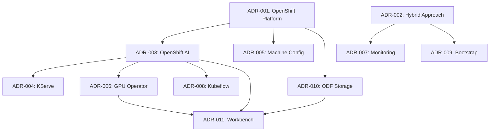

# Architectural Decision Records (ADRs)

## Overview

This document provides a comprehensive reference to all Architectural Decision Records (ADRs) for the OpenShift AIOps Self-Healing Platform. ADRs document the key architectural decisions, their context, and rationale.

## ADR Index

| ADR | Title | Status | Date | Category |
|-----|-------|--------|------|----------|
| [ADR-001](../adrs/001-openshift-platform-selection.md) | OpenShift Platform Selection | Accepted | 2025-10-09 | Infrastructure |
| [ADR-002](../adrs/002-hybrid-self-healing-approach.md) | Hybrid Deterministic-AI Self-Healing Approach | Accepted | 2025-10-09 | Architecture |
| [ADR-003](../adrs/003-openshift-ai-ml-platform.md) | OpenShift AI ML Platform Integration | Accepted | 2025-10-09 | AI/ML |
| [ADR-004](../adrs/004-kserve-model-serving.md) | KServe Model Serving Infrastructure | Accepted | 2025-10-09 | AI/ML |
| [ADR-005](../adrs/005-machine-config-operator-automation.md) | Machine Config Operator for Node Management | Accepted | 2025-10-09 | Infrastructure |
| [ADR-006](../adrs/006-nvidia-gpu-management.md) | NVIDIA GPU Operator for AI Workload Management | Accepted | 2025-10-09 | Hardware |
| [ADR-007](../adrs/007-prometheus-monitoring-integration.md) | Prometheus-Based Monitoring and Data Collection | Accepted | 2025-10-09 | Monitoring |
| [ADR-008](../adrs/008-kubeflow-pipelines-mlops.md) | Kubeflow Pipelines for MLOps Automation | Accepted | 2025-10-09 | MLOps |
| [ADR-009](../adrs/009-bootstrap-deployment-automation.md) | Bootstrap Deployment Automation Architecture | Accepted | 2025-01-09 | Deployment |
| [ADR-010](../adrs/010-openshift-data-foundation-requirement.md) | OpenShift Data Foundation as Storage Infrastructure Requirement | Accepted | 2025-10-13 | Storage |
| [ADR-011](../adrs/011-self-healing-workbench-base-image.md) | Self-Healing Workbench Base Image Selection | Accepted | 2025-10-13 | Development |
| [ADR-012](../adrs/012-notebook-architecture-for-end-to-end-workflows.md) | Notebook Architecture for End-to-End Self-Healing Workflows | Proposed | 2025-10-13 | Development |
| [ADR-013](../adrs/013-data-collection-and-preprocessing-workflows.md) | Data Collection and Preprocessing Workflows | Proposed | 2025-10-13 | AI/ML |
| [ADR-014](../adrs/014-openshift-aiops-platform-mcp-server.md) | MCP Server Integration Architecture for Development and Operations | Proposed | 2025-10-13 | Development |

## ADR Categories

### Infrastructure Decisions
- **ADR-001**: Platform selection (OpenShift 4.18+)
- **ADR-005**: Node management strategy
- **ADR-010**: Storage infrastructure requirements

### Architecture & Design
- **ADR-002**: Hybrid self-healing approach combining deterministic rules with AI
- **ADR-009**: Bootstrap and deployment automation

### AI/ML Platform
- **ADR-003**: OpenShift AI integration for ML workloads
- **ADR-004**: Model serving with KServe
- **ADR-006**: GPU acceleration for AI workloads
- **ADR-008**: MLOps pipeline automation
- **ADR-011**: Development environment setup

### Monitoring & Operations
- **ADR-007**: Prometheus-based monitoring and alerting

## Key Architectural Principles

Based on the ADRs, the platform follows these principles:

### 1. Hybrid Intelligence (ADR-002)
- **Deterministic Rules**: Fast, predictable responses for known issues
- **AI-Driven Analysis**: Machine learning for complex pattern recognition
- **Coordinated Approach**: Intelligent orchestration between rule-based and AI systems

### 2. Cloud-Native Design (ADR-001, ADR-005)
- **OpenShift Foundation**: Enterprise Kubernetes platform
- **Operator Pattern**: Kubernetes-native management
- **GitOps Principles**: Declarative configuration management

### 3. AI/ML First (ADR-003, ADR-004, ADR-006)
- **GPU Acceleration**: NVIDIA GPU support for training and inference
- **Model Serving**: KServe for production model deployment
- **MLOps Integration**: Automated model lifecycle management

### 4. Observability-Driven (ADR-007)
- **Prometheus Metrics**: Comprehensive monitoring
- **Alert-Based Triggers**: Proactive issue detection
- **Data-Driven Decisions**: Metrics inform self-healing actions

### 5. Developer Experience (ADR-011)
- **Enterprise Base Images**: Red Hat supported containers
- **Integrated Development**: Jupyter-based AI/ML development
- **Persistent Storage**: Shared model and data artifacts

## Implementation Status

### ✅ Completed
- **Infrastructure**: OpenShift cluster with ODF storage
- **Development Environment**: PyTorch workbench with GPU support
- **Coordination Engine**: Basic self-healing framework
- **Bootstrap Automation**: Deployment and validation scripts

### 🚧 In Progress
- **Model Serving**: KServe integration
- **Monitoring**: ServiceMonitor and PrometheusRule setup
- **MLOps Pipeline**: Kubeflow Pipelines integration

### 📋 Planned
- **Advanced AI Models**: Anomaly detection algorithms
- **Self-Healing Logic**: Production-ready remediation
- **Security Hardening**: Compliance and security policies

## Decision Dependencies

## Usage Guidelines

### For Developers
1. **Read ADR-011** for workbench setup and development workflow
2. **Review ADR-002** to understand the self-healing architecture
3. **Check ADR-003 and ADR-004** for AI/ML integration patterns

### For Operators
1. **Follow ADR-009** for deployment procedures
2. **Implement ADR-007** for monitoring setup
3. **Use ADR-010** for storage configuration

### For Architects
1. **Study ADR-002** for system design principles
2. **Review all ADRs** for comprehensive understanding
3. **Update ADRs** when making architectural changes

## ADR Lifecycle

### Status Definitions
- **Proposed**: Under consideration and review
- **Accepted**: Approved and being implemented
- **Deprecated**: No longer valid but kept for history
- **Superseded**: Replaced by a newer decision

### Update Process
1. Create new ADR for significant architectural changes
2. Update existing ADRs when implementation details change
3. Mark ADRs as deprecated when no longer applicable
4. Reference related ADRs to maintain traceability

## Related Documentation

- [Bootstrap Testing Guide](../how-to/bootstrap-testing.md)
- [Workbench Development Guide](../tutorials/workbench-development-guide.md)
- [Deployment Procedures](../how-to/deploy-to-production.md)
- [Architecture Overview](../explanation/architecture-overview.md)
